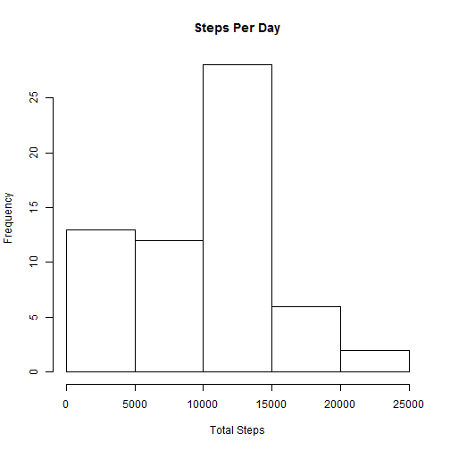
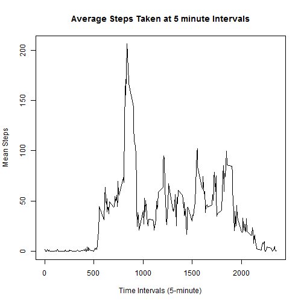
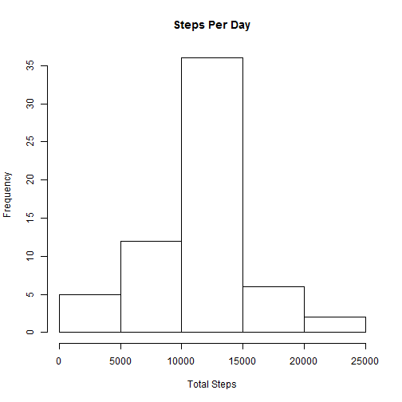

# Instruction: Generating html / md files using knit2html
--- 
library(knitr)
knit2html(input = "PA1_template.Rmd")
---

# Load Package

```r
library(lattice)
```

# Loading and preprocessing the data
Compute the Total Steps for each day

```r
data <- read.csv("activity.csv", colClasses=c("integer","Date","integer"))
total.steps <- tapply(data$steps, data$date, FUN = sum, na.rm = TRUE)
```

# What is mean total number of steps taken per day?
Plot the graph

```r
hist(total.steps, main = "Steps Per Day", xlab="Total Steps", ylab="Frequency")
```

 
Calculate and report the mean and median total number of steps taken per day

```r
mean(total.steps)
```

```
## [1] 9354.23
```

```r
median(total.steps)
```

```
## [1] 10395
```

# What is the average daily activity pattern?
Plot Mean Steps

```r
mean.steps <- tapply(data$steps, data$interval, FUN = mean, na.rm = TRUE)
plot(row.names(mean.steps),mean.steps,type="l", xlab="Time Intervals (5-minute)",ylab = "Mean Steps", main = "Average Steps Taken at 5 minute Intervals")
```

 

# Maximum number of steps

```r
names(which.max(mean.steps))
```

```
## [1] "835"
```

# Imputing missing values
1. Calculate and report the total number of missing values 

```r
sum(is.na(data))
```

```
## [1] 2304
```
2.Devise a strategy for filling in all of the missing values in the dataset

```r
missing.idx <- which(is.na(data))
upd.data <- data
for(i in missing.idx) {
  if(is.na(data[i,]$steps)) {
 		upd.data[i,]$steps = mean.steps[as.character(data[i,]$interval)]
	}
}
total.steps <- tapply(upd.data$steps, upd.data$date, FUN = sum, na.rm = TRUE)
hist(total.steps, main = "Steps Per Day", xlab="Total Steps", ylab="Frequency")
```

 

```r
mean(total.steps)
```

```
## [1] 10766.19
```

```r
median(total.steps)
```

```
## [1] 10766.19
```

# Are there differences in activity patterns between weekdays and weekends?

```r
days <- weekdays(upd.data$date)
upd.data$day.type <- ifelse(days == "Saturday" | days == "Sunday", "Weekend", "Weekday")
mean.steps <- with(upd.data, aggregate(steps,by=list(interval, day.type), mean))
names(mean.steps) <- c("Interval", "Day_Type", "Steps")
xyplot(Steps ~ Interval | Day_Type, mean.steps, type = "l", layout = c(1, 2), xlab = "Interval", ylab = "Number of Steps")
```

 
